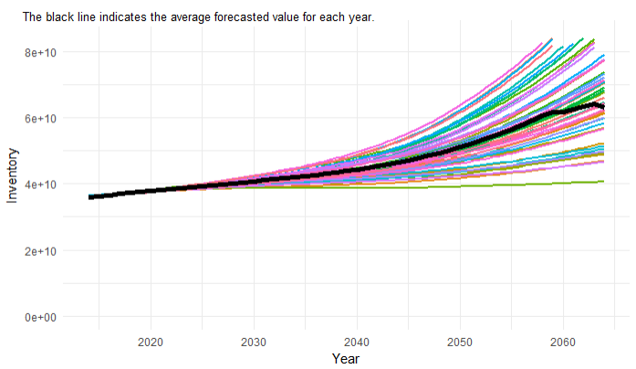

```{r, echo=FALSE}
htmltools::img(src = knitr::image_uri("brown-forman-2788813.png" ), 
               alt = 'Brown Forman Logo', 
               style = 'position:absolute; top:0; left:450px; padding:10px;')
```


**Created by Bellarmine University Graduate Students**

### *Conclusion/Result*

**The white oak population will stay relatively flat in the next 10 years.** Due to limited historical data, it is important to use caution when interpreting these results further into the forecast horizon. With only 13 annual data points to build the forecast, looking out past ten years serves best as a directional indication of the White Oak population.

### *Methodology*

To build a forecast for the white oak population over the next 50 years, we decided to use a **simulation**. A simulation will allow us to forecast current trends in growth, removal, and mortality, as well as incorporate variables to capture the rare events such as catastrophic wildfires, category 5 tornados, and large-scale pest outbreaks. These are events that we would not expect to occur every year, or even once every 10 years. Therefore, by incorporating the probability of these events to occur each year we are able to get a better understanding of how potential environmental disasters can impact the population.

Included in the simulation is the current trend of growth, removal, and mortality, as well as the associated error so that we can be sure to capture the full range of where we might expect the population to be. These trends, as well as the potential for environmental outbreaks, will give us a final forecast that will be based off the average of all the simulated outcomes, and that should be relatively close to where we would expect the true population to be over the next few years.

### *Purpose*

The Brown-Forman production team has requested a forecast of the White Oak population in order to better understand any short and/or long term risk associated with the population growth and mortality. A previous consultant had provided a forecast that had some fairly significant errors, and our goal was to enhance the consultant's work so that the resulting forecast is up-to-date and accurate.

### *Data*

The data used for this analysis was received from the U.S. Forest Service. The data contains annual, unit level volumes for White Oak on private, non-industrial lands in the Eastern states, and includes detail on the Growing Stock Inventory, Growth, Removal, and Mortality in cubic feet. The data spans the period 2003 through 2014.

### *Simulation Dashboard*

In the simulation outline, we sample from a normal distribution with a mean equal to the coefficient of a linear model and a standard deviation equal to the standard error on the coefficient estimate in order to obtain rate of change values the growth, removal, and mortality percent of inventory. We then calculate the new percent of inventory each year by multiplying the number of years elapsed by the rate of chance (ROC) and add an intercept (calculated by taking the mean of the last 5 years of data). We also include a yearly shock value to provide a simple example of how we can incorporate the outside variables like wildfire, pests, drought, etc. The initial inventory value is the true inventory in the year 2014, and each subsequent year is calculated by adding/subtracting the growth, removal, mortality, and yearly shock values.

As well as an inventory forecast, we also provide an upper bound and a lower bound (95% confidence interval), based off of the upper and lower estimates for the slope coefficient from the model. The 95% confidence interval means that we are 95% confident that the true values lies somewhere between the upper and lower bounds.

#### *Simulation*

```{r, echo=FALSE}
#Include Simulation PNG file at bottom
htmltools::img(src = knitr::image_uri("Simulation.PNG" ), 
               alt = 'Brown Forman Logo', 
               style = 'position:absolute; bottom:0; left:150px; padding:10px;')
```

```{r, echo=FALSE}
### *Apendix*
#### *Simulation Variables*
#
#1. **White Oak**
#+ The White Oak data used for this analysis was received from the U.S. Forest Service (USFS). The data contains annual, unit level volumes for White Oak on private, non-industrial lands in the Eastern United States, and includes detail on the Growing Stock Inventory, Growth, Removal, and Mortality in cubic feet. The data spans the period 1968 through 2017. Although we have data for this period, the USFS changed the method that they use to build their population estimates, and therefore only data from 2002 onward will be used in this analysis, for consistency purposes.
#2. **Wildfire**
#+ The wildfire data used for this analysis contains information on the notable wildfires that have occurred throughout history. These include the largest fires recorded in various states, as well as fires with high levels of destruction associated with them.
#3. **Invasive Species - Pests**
#+ The Pest data used for this analysis was captured from the U.S. Department of Agriculture Forest Service. The data contain acres by state and region of pests (insects and disease) for forestry damage types: Defoliation, Mortality, and Other.
#+ Acres are summarized from the current year’s observations only and are not cumulative. To avoid the multiple counting of acres, do not total these summaries across pests, years or damage types.
#+ Source: [link]https://foresthealth.fs.usda.gov/portal/PestSummary/DamageSummary
#4. **Drought**
#+ The Palmer Drought Severity Index is a measure of dryness in a region based on the amount of recent precipitation and overall temperature. It typically ranges from -4 being an extreme drought to +4 for extreme moisture although it can exceed those points up to +/- 7.
#+ Source: [link]https://www.ncdc.noaa.gov/temp-and-precip/drought/historical-palmers/
#5. **Climate/Natural Disasters**
#+ For this analysis we will utilize the four climate models created by the IPCC to understand how climate can affect the growth, removal, and mortality of the white oak population
#+ Source: [link]https://www.data.gov
```
